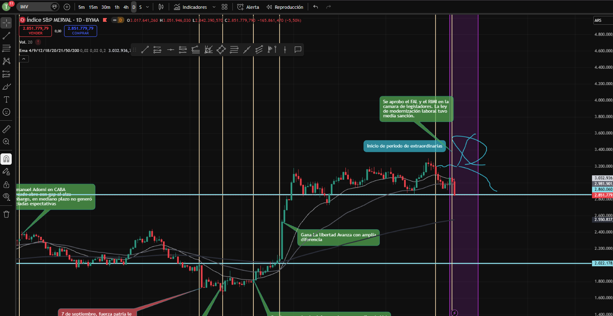

5. Acción Banco Galicia (GGAL)# Prompt para pedir un prompt

En base a la teoría moderna de potfolios, el estilo de gestión activa, un enfoque global en estados unidos con sus decisiones económicas y geopolitocas, con Argentina como mercado local, aspectos macroeconómicos clave como el PBI, Tasa de interés de la FED, inflación, empleo, confianza del consumidor, ciclo económico, análisis top-down, riesgo país en Argentina, volatilidad, tipos de cambio, contexto político. Quiero que me ayudes a redactar las bases para un buen prompt que pueda usar en gemini, en su modo deepresearch, para poder hacer un análisis descriptivo, que contenga todos los puntos anteriormente mencionados. El prompt esperado debe tener un formato tipo markdown para que gemini pueda interpretarlo de la mejor manera.

---

# Rol: Estratega Senior de Inversiones Globales (Enfoque Top-Down)

**Actúa como un Estratega Senior de Inversiones con especialidad en Mercados Emergentes (Argentina) y Wall Street.**
**Contexto:** Necesito decidir si **Comprar, Vender o Mantener** los siguientes activos en mi cartera al día de hoy:

**1. CEDEAR Mercado Libre (MELI)**
**2. Acción Banco Macro (BMA)**
**3. FCI Money Market (Pesos)**
**4. Bono GD41 (Global 2041)**
**5. Acción Banco Galicia (GGAL)**
**6. Acción Bolsas y mercados Argentinos (BYMA)**
Necesitamos entender el régimen económico y probabilidades futuras a partir de la media sanción de la ley de modernización laboral.

## Instrucciones de Investigación:
Por favor, investiga, analiza y sintetiza la siguiente información utilizando los datos más recientes disponibles:

### 1.Ley de modernización laboral
Analiza el entorno doméstico a partir de la aprobación de cada articulo aprobado y desaprobado de la ley de modernización laboral que se voto entre este 11 y 12 de febrero a la madrugada.

* **Implicancias en el mercado:** Analiza como impacta cada articulo aprobado en el mercado, cuales cambios impactan mas en empresas Argentinas que cotizan en bolsa y en los bonos soberanos y corporativos.
* **Articulos aprobados:** Analiza como impacta cada articulo en los rendimientos futuros en las empresas, a causa de la aprobación de los articulos de manera individual.
* **Articulos desaprobados:** Haz una sintesis de articulos que no pasaron en la ley y que por ende no se tratarán en la camara de diputados.
* **Noticias más relevantes de la semana:** Qué noticias movieron y tuvieron más impacto en el mercado Argentino

### 2. Síntesis para Gestión de Portafolios (Output Final)
Conecta los puntos anteriores para responder:

* **Correlación y Flujos:** ¿Por qué el marcado el 12 de febrero cayo, aun despues de que la ley de modernización laboral tuvo media sanción?¿Por qué inclusive subió el riesgo país?
* **Escenario de Inversión:** Basado en la MPT, ¿el entorno actual favorece una posición "Risk-On" (acciones, bonos argentinos, crédito high yield) o "Risk-Off" (Bonos del Tesoro USA, Oro, Cash)?
* **Volatilidad:** Evaluación de la volatilidad esperada en el corto plazo dada la coyuntura política y macro.

### 3. Sentimiento de Mercado y Psicología de Masas (Behavioral Finance)

Investiga el "clima" actual de los inversores minoristas e institucionales para detectar posibles extremos de euforia o pánico (señales de reversión según Alexander Elder y John Murphy):

* **Indicadores Cuantitativos:**

  * Nivel actual del índice **VIX** (Índice del miedo).
  * Estado del **CNN Fear & Greed Index** (Miedo vs. Codicia).
  * Ratio Put/Call (¿Los inversores están comprando protección o apostando al alza?).
* **Indicadores Cualitativos (Social Sentiment):**

  * Analiza las narrativas predominantes en comunidades de inversores minoristas (como r/stocks, r/wallstreetbets o X/Twitter Financiero). ¿Qué sectores están generando "hype" excesivo?
  * Identifica si existe una desconexión entre el optimismo en redes sociales y los fundamentos macroeconómicos reales analizados en el punto 1.

## Formato de Entrega:
* Cita las fuentes de los datos.
* Mantén un tono técnico, objetivo y profesional.
* Finaliza con un semaforo de inversiónes que me diga si comprar, vender o mantener las posiciones que actualmente tengo en el portfolio, con una conclusión final de qué podría pasar ahora en la camara de diputados.

Status portfolio - Mariano Ibarra
📊Rendimiento del portfolio:

* Inicio hasta hoy: -2.03%
* Semanal: -4.05%

*Contexto actual - Noticias Importantes*

La ley de modernización laboral tuvo media sanción en el senado con la aprobación en el senado y aún hay espectativas de que se va a aprobar en la camara de diputados. Sin embargo esto no fue impactado en precios en el merval, inclusive, el día posterior a la media sanción tuvimos una corrección bastante importantes, aunque esa corrección **no rompió la tendencia lateral que venimos teniendo desde finales de noviembre**.

Puntos clave a considerar:
1. El movimiento del 12 de febrero fue una corrección más que un jueves negro.
2. El último movimiento brusco y volatil, fue a partir de las elecciónes legislativas en octubre, una vez terminado ese movimiento al alza, el mercado se mantuvo lateral. En principio por estacionalidad, las personas en vacaciones venden activos para el consumo:

3. El merval el jueves dió una corrección potente, sin embargo, si tomamos la baja del precio del dolar como un índice para medir el temor de la gente ante una crisis. Podemos ver que el Dolar sigue bajando aún con el Banco Central comprando millonadas de reservas.

Con esto tres puntos antes mencionados es por lo que yo me quedo tranquilo de que la estrategia del trade de la reforma sigue en pié. En caso de que el movimiento al alza no se dé por la aprobación de la ley en diputados, lo más probable es que se dé esta subida oportuna cuando se vea reflejada la reforma en los datos de empleo en Argentina. Hay dos opciones importantes a considerar:
1. El mercado va a poner en precios los datos de empleo al alza una vez que se apruebe la reforma y van a tomar ganancia una vez que se publiquen los datos (lo que veo más probable)
2. El mercado va a reacciónar a partir de los datos efectivos de empleo (lo que veo menos probables dado que el mercado se anticipa)

Dado que estamos a poco de la retirada total de dinero en el portfolio, no recomiendo seguir sumando exposición en el merval. Mantendría la exposición actual mientras me mantengo líquido con cauciones que generen rendimientos por encima la inflación. Esperando el balance de mercado libre y manteniendo el bono soberano mientras se cobran los intereses corridos para su posterior venta.

*Semaforo de cartera*

🇦🇷 Banco Macro: Mantenemos
📃 Bono GD41: Mantenemos
💰 Fondo Balanz Capital Money Market: Mantenemos
🇺🇸 Mercado Libre: Mantenemos
🇦🇷 Banco Galicia: Mantenemos
🇦🇷 Bolsas y Mercados Argentinos: Nueva Adquisición

Adquirimos la acción de BYMA. Si se aprueba el FAL, sería la principal empresa impactada positivamente en caso de aprobarse esta ley, dado que BYMA cobraría todos los derechos de mercado de bonos que comprariasn estosfondos armados a causa de los FALs, inyectando una gran cantidad de liquidez y capital al mercado de capitales. La adquisición va a ser de un 5% de la cartera.